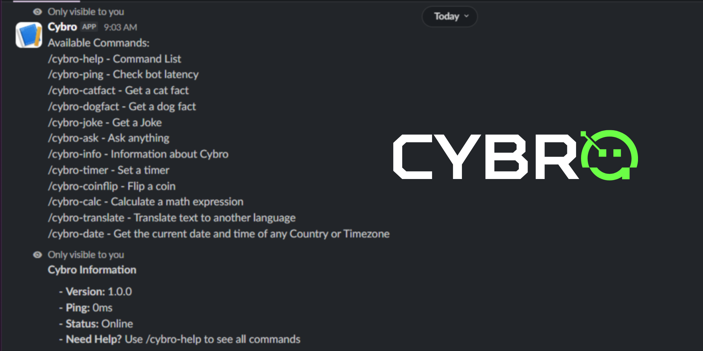

# Cybro

Cybro is a simple Slack bot that bring AI chat, quick mah, translations, and some utiliies right ino your Slack workspace chats. It's built with JavaScript using Slack's Bolt framework.




## [Try the live Demo](https://hackclub.enterprise.slack.com/archives/C0BFJLJ6KUG)


## Quick Start

Run Cybro locally in your own workspace in under a minute:

```bash

# Clone the repo
git clone https://github.com/RajanKCKC/Cybro.git

# Install he dependencies
npm install

# Start the bot
npm start

```
# Slash Commands

Instead of dealing single confusing chat interface, you can use direct slash commands for whatever you need:

* `/cybro-help` - Gives the list of available commands.
* `/cybro-ping` - Check the latency of the bot.
* `/cybro-catfact` - Gives facts about cats.
* `/cybro-dogfact` - Gives facts about dogs.
* `/cybro-joke` - Gives bes and funniest jokes.
* `/cybro-ask` - Ask Google's Gemini 3.5 Flash model anything (Via HackClub's AI API)
* `/cybro-info` - Gives Information about Cybro
* `/cybro-timer` - Spawns a live-updating progress bar in your channel.
* `/cybro-coinflip` - Flip a coin.
* `/cybro-calc` - Solve math formulas instanlly.
* `/cybro-translate` - Translate text to another language.
* `/cybro-date` - Get the current date and time of any Country or Timezone.


## Setup

### Requirement

* **Node.js** (v18 or higher)
* A slack App with Aocket Mode enabled.


### 1. Environment Variables

Create a `.env` files in your root folder and add your keys:

```env
SLACK_BOT_TOKEN=xoxb-....  # Bot User OAuth Token (from OAuth & Permissions)
SLACK_APP_TOKEN=xapp-....  # App-Level Token (from Basic Information → App-Level Tokens)

HACKCLUB_AI_API=https://ai.hackclub.com/proxy/v1/chat/completions # Hack Club AI API Endpoint
HACKCLUB_AI_API_KEY=sk-hc-....  # Hack Club AI API Key (from Hack Club AI)     
```

### 2. Enable the Commands

Make sure to add these exact slash command inside your Slack App setting dashboard so Slack knows  where to route them:

`/cybro-help`, `/cybro-ping`, `/cybro-catfact`,
`/cybro-dogfact`, `/cybro-joke`, `/cybro-ask`,
`/cybro-info`, `/cybro-timer`, `/cybro-coinflip`,
`/cybro-calc`, `/cybro-translate`, `/cybro-date`


# Credits 

* **Slack Bolt SDK** - Powers the bot logic.
* **HackClub AI API** - Provides the `gemini-3.5-flash` model access.
* **Public APIs** Used for fetching global times, jokes, and facts.
